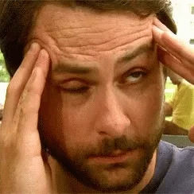
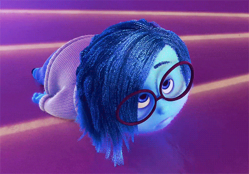
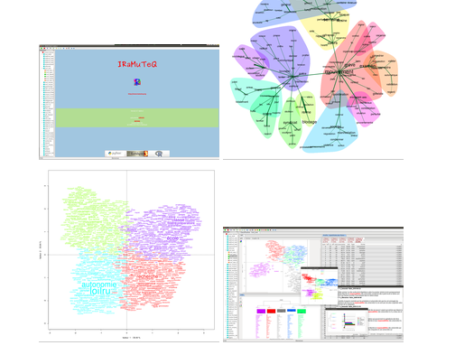
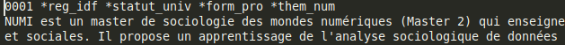

```{r setup, echo=FALSE}
library(knitr)


```


class: center, middle, inverse

# Contenu de l'Atelier

I- Objectifs de l'atelier

II- Petit tour d'horizon de l'analyse textuelle

III-Travaux pratiques

---

class: center, middle, inverse


# Nos objectifs


---
### Objectifs

Avant de commencer voici ce que cet atelier n'est pas :
  >1. Ce n'est pas un cours magistral.
1. Ce n'est pas une formation exhaustive et complète sur l'analyse de contenu textuel.

Et voilà nos objectifs :
  >1. Echanger autour de l'analyse textuelle.
1. Vous données quelques clés pour plonger dans ce monde.
1. Tester et maniper par vous même.
1. En bonus : vous donner envie d'en faire plus
  
.full-width.content-box-green[En bref, à l'issue de l'atelier vous ne serez pas des experts, mais vous aurez quelque armes pour démarrer et éventuellement aller plus loin !]

---

class: center, middle, inverse


# C'est quoi l'analyse textuelle ?


---
### Le monde de l'analyse textuelle

L'analyse textuelle c'est quoi ?
  > C'est tout simplement le fait d'analyser du texte !

Cette définition n'a effectivement aucun intérêt.

Mais elle a le mérite de laisser entrevoir à quel point le monde de l'analyse textuelle est vaste et les possiblités énormes 
  > On va pouvoir travailler sur n'importe quelle sources textuelles : Les ouvrages littéraires, les pièces de théatre, les discours, les textes de lois, des sites web, des flux RSS, des forums... **ET bien sur des questions ouvertes d'enquêtes, des focus groupes ou des entretiens.**
  
.full-width.content-box-green[Le corollaire indésirable c'est que l'on trouve une quantité énorme de méthodes, d'approches et d'outils. Avec en plus souvent un mélange et une confusion entre méthodes, approches et outils.]

---
### Le monde de l'analyse textuelle 2

Si on essaie d'être un peu plus constructif, on peut diviser tout cet univers en 2 grands blocs :

1. D'un côté une approche qualitative : on trouvera les termes d'approches reflexive, thématiques...
1. De l'autre côté une approche quantitative : on entendra parler de la statistique textuelles, du text mining, lexicométrie... (c'est cette approche que nous testerons)

---
### Quali VS Quanti

L'approche thématique est l'héritière d'une approche qu'on pourrait appeler "papier-crayon".

Ce n'est pas une méthode automatique, c'est le chercheur ou professionnelle qui en fonction de ses lectures, sa connaissance du sujet, de son expertise va faire émerger des thèmes, catégories... et réaliser des extractions sélectives.

Les logiciels auront pour objectif de faciliter ce travail en permettant des annotations, du surlignage, la création de collections, regrouper des éléments identifiés illustrant le même thème...

.full-width.content-box-green[Ces outils sont regroupés sous la dénomination CAQDAS (Computer AssistedQualitative Data AnalysisSoftware). On peut citer par exemple : Atlas-ti, Nvivo, MaxQDA, RQDA...]

---
### Quali VS Quanti 2

La statistique textuelle a elle pour objectif de comparer des textes sur la base d'une étude quantitative des mots. On va chercher quels sont les mots qui caractérisent nos textes par leur présence ou absence.
  > On va s'intéresser à la forme des textes en faisant abstraction de leur contenu. Et faire émerger le contenu de textes, leurs sens au-delà de leur forme.

Avec les logiciels on pourra faire des résumes automatiques, compter les mots, identifier des thèmes, trouver des structures, analyser des relations.
Bref pas si différents de l'analyse quali.

.full-width.content-box-green[Ces outils reposent sur des algorithmes et des statistiques. Ils sont plutôt à la mode en ce moment et ont grandement bénéficiés des progrés de l'informatique et autres intélligences articficiels. On peut citer : Alceste, Iramuteq, Cortext, R.temis, R, Python...]

---
### Quali VS Quanti : quel est le gagnant ?

Ces deux familles se distinguent par leurs approches, méthodes et outils différents mais pas par les données textuelles en elles mêmes.

  >Le choix se fera finalement en fonction de vos préférences, de pratiques disciplinaires ou des caractérisiques de l'analyses que vous souhaitez réaliser.


.important[
Ces deux approches ne s'opposent en aucun cas, l'une n'est pas meilleure que l'autre ! L'idéal étant de les associer. Vive la mixité !]

---
###  Quel outil choisir ?

C'est une bonne question, sans vraiment de réponse.

Il n'existe pas d'outil parfait, hormis celui que vous maitrisez et qui vous permet de répondre à vos hypothèses et questions.

Dans les faits il faudra souvent associer différents outils, en reflichissant à vos contraintes :
  > Outils gratuits VS outils payants / En français VS dans une autre langue / User friendly VS techniques / Tutoriel complet VS débrouillez-vous...

---
class: center, middle, inverse

# Est ce que ça va ?



---
### Un peu de vocabulaire

L'occurrence : il va s'agir du nombre de fois qu'un mot apparaît.

La forme : correspond au mot. Il y a autant de formes que de mots différents

.small[.full-width.content-box-green[Par exemple dans la phrase : *Le petit chat est mort, c'est dommage il était sympa le chat*.
On va compter 13 occurrences et 10 formes.]]

Le corpus : L'ensemble des textes étudiés.

Le segment de texte : Une portion de texte, la taille de ce segment peut varier.

---
### Lemmatisation et stemmatisation

La lemmatisation : C'est rattacher un ou plusieurs mots à une forme dite racine. (Lebart, Salem, 1994)
  > .small[C'est à dire convertir les formes verbales sous leur forme infinitive, les substantifs au singulier, et les noms et adjectifs au masculin singulier. Par exemple : le chat, les chats et la chatte réunit sou sune seule forme : le chat.]

La stemmatisation : C'est conserver que le radical des mots, pour regrouper sous le même radical tous les mots d'une famille.
  > Par exemple : reunir le chat, leschats, les chatons et la chatte sous la forme de cha

---
### Précision sur la lemmatisation et la stemmatisation

.small[Que ce soit dans un cas comme dans l'autre, il s'agit d'une perte d'information.

En effet, on procède finalement a une réduction d'une nombre de forme. Ce n'est donc pas une action à réaliser à la légère mais peut s'avérer utile avec des corpus de bonne taille avec un vocabulaire riche et varié.

Par exemple :]

.small[.full-width.content-box-green[voici des réponses données par des conducteurs RATP sur leur métier:
Conduire / Passager / Boire => Mais ce n'est pas boire mais bus, que le logiciel a pris pour une forme conjuguée du verbe.]]

.small[.full-width.content-box-green[Réponses des conducteurs sur leur rapport à leur voiture :
Prendre / Route / Vole => Mais Vole est le lemme du participe présent de volant alors qu'en réalité il s'agit du volant de la voiture.]]

---

class: center, middle, inverse

# Ouf ! Fini pour la théorie !

**Y a t'il des questions ?**



---
class: center, middle, inverse

# Maintenant la pratique !


---
### Préambule : le logiciel

Nous allons donc faire un peu de statistiques lexicales.

Pour ce faire nous allons utiliser le logiciel Iramuteq.

Il s'agit d'un logiciel libre, c'est à dire avec un code ouvert et gratuit. C'est un logiciel français avec une documentation riche et un grand nombre de tutoriel en français : https://www.iramuteq.org

```{r, echo=FALSE, out.width = "50%", fig.align='center'}

```

---
### Préambule : Nos données

Nous allons analyser un corpus de 96 présentations des masters de sociologie en France sur lesquels on dispose de métadonnées statut (université, association ou école), région géographique où se situe le master (reg), form caractérise le type de formation (master professionnel ou master recherche), et them pour décrire la spécialisation du master selon 8 grands thèmes (politique, général, travail, urbain, technologie, culture, genre, santé) et un identifiant num.

La mise en forme pour utiliser Iramuteq est très particulière mais très bien décrit ici : http://www.iramuteq.org/documentation/html/2-2-2-les-regles-de-formatages

```{r, echo=FALSE, out.width = "100%", fig.align='center'}

```

---
class: center, middle, inverse


